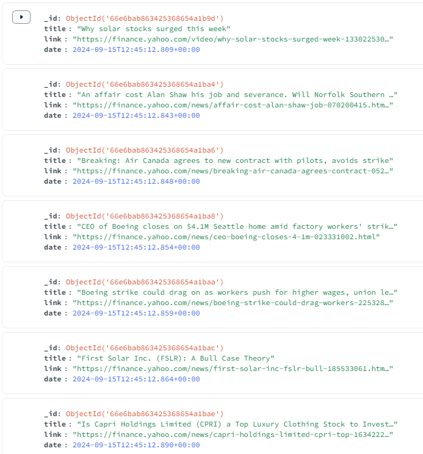

# Web Crawling Yahoo News Scraping

This Python-based web crawler is designed to crawl news websites, scrape articles, and store them in a MongoDB database. The crawler starts with a set of initial URLs, follows all links on each webpage, and continues crawling using a queue. It also checks the `robots.txt` file for each site to ensure compliance with the site's crawl policies. For websites with dynamically loaded content, the crawler uses **Selenium** to automate a browser for rendering the page before scraping.

## Crawling Results

The crawler was run for a few hours, during which it successfully crawled around **2200 unique articles** from the Yahoo Finance news website. The articles were stored in a MongoDB database, with all relevant metadata for easy retrieval and querying.

Example reults:


## Features

### 1. URL Crawling
- Starts with a list of initial URLs.
- Extracts all URLs on each page and adds them to a crawl queue.
- Navigates through the URLs to discover and scrape new content.

### 2. Article Scraping
- Scrapes news articles from each webpage visited.
- Handles dynamically loaded content by automating a browser using **Selenium**.
- Stores the scraped articles in a MongoDB database for easy retrieval and querying.

### 3. `robots.txt` Compliance
- The crawler checks each website's `robots.txt` file before making a request to respect crawl policies.
- Avoids URLs that are explicitly disallowed by `robots.txt`.

### 4. MongoDB Integration
- The scraped articles are stored in MongoDB for efficient storage and retrieval.
- Each article is saved with metadata (e.g., id, title, URL, crawl date) to enable structured queries.

## Setup

### Prerequisites
- Python 3.x
- pymongo
- Selenium
- beautifulsoup4
- requests
- lxml
- A web browser (e.g., Chrome, Firefox) along with the respective Selenium driver (e.g., ChromeDriver)

### Installation

1. Clone this repository:
    ```bash
    git clone https://github.com/amndzdzdz/Web-Crawler.git
    ```

2. Install the required Python libraries:
    ```bash
    pip install -r requirements.txt
    ```

3. Download and configure the web driver for Selenium (e.g., ChromeDriver or GeckoDriver) and ensure it's accessible from your PATH.

4. Configure MongoDB connection in the crawler script:
    ```python
    client = MongoClient()
    your_database_name = client.your_database_name
    your_collections_name = your_database_name.your_collections_name
    ```

5. Run the crawler:
    ```bash
    python crawler.py
    ```

## Contributing
Feel free to submit pull requests or open issues for improvements, bug fixes, or feature requests!
